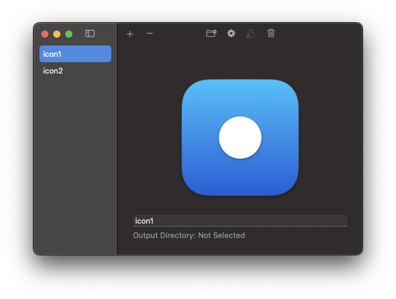

# ICNS Generator 

A macOS app for creating `.iconset` and `.icns` files from images. 

  

## Usage

1. Run the app.
2. Select an image and output directory.
3. Generate icons and `.icns` file.

Licensed under [MIT](LICENSE).
